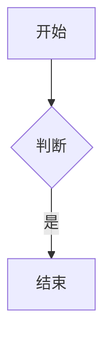

# Mono 使用手册

面向站点所有者与作者的日常使用指南。开发插件请另见 `PLUGIN.md`，架构理念见 `DEVELOPMENT_RULES.md`。

## 1. 安装

1. 确保服务器 PHP ≥ 8.1 且启用 PDO（`pdo_sqlite` / `pdo_mysql` / `pdo_pgsql` 按需其一）。
2. 上传全部文件，保证 `app/data` 目录可写。
3. 访问首页进入安装向导：
   - **数据库类型**：选 SQLite 时只需填文件名（默认 `blog.sqlite`，自动创建）；选 MySQL / PostgreSQL 时才需填地址/端口/库名/账号/密码（表单会按类型自动显隐字段）。
   - **站点与管理员**：填站点名称、描述与管理员账号密码（密码至少 4 位）。
4. 点击「开始安装」，完成后自动登录管理员并跳转首页。

本地快速预览：

```bash
php -S 127.0.0.1:8080 index.php
```

## 2. 写文章

入口：右上角头像子菜单「写文章」（登录后）或后台「写文章」。顶部导航默认展示首页/归档/独立页面，分类不在导航展示（侧栏已有完整分类列表）。

- **标题 / 分类 / 状态 / 标签**：两行紧凑布局——标题+状态一行、分类+标签一行；新文章状态默认「草稿」，避免误发布；标签用逗号或空格分隔。
- **允许评论**：启用「评论」插件后，分类+标签一行末尾出现「允许评论」勾选（默认勾选）；不需要评论的文章取消勾选，该文章即不显示评论区、也无法提交评论（插件未启用时该项不显示）。
- **分类与未分类的区别**：「默认分类」是安装时创建的真实分类（可改名/删除），新文章默认归入排序第一的分类；「未分类」不是分类，而是 `category_id=0` 的空状态（如所属分类被删除后），仅在编辑这类文章时出现在下拉中供重新选择。
- **快捷新建分类**：分类下拉旁的「+」按钮可即时新建分类（AJAX 提交，不刷新页面、不丢失草稿），成功后自动选中新分类。
- **正文编辑器**：带工具栏（加粗/斜体/删除线/行内代码/标题/有序·无序列表/引用/链接/图片/代码块/Mermaid 图表/表格/分割线），右侧为「分栏」「全屏」开关；支持快捷键 `Ctrl/Cmd+B`、`Ctrl/Cmd+I`、`Ctrl/Cmd+K`，`Tab` 缩进；底部状态栏实时统计字数。
- **分栏预览**：点「分栏」左右分栏、右栏防抖实时渲染 Markdown（替代旧「预览」按钮），再点关闭；窄屏（≤860px）自动改为上下堆叠。
- **全屏写作**：点「全屏」沉浸写作（锁定页面滚动），`Esc` 或再点退出；可与分栏叠加使用。
- **保存**：页底仅一个右对齐保存按钮；新文章按状态提示「草稿已保存」或「文章已发布」。

### 代码块：语法高亮 + 一键复制

用三个反引号包裹并标注语言即可获得服务端语法高亮，代码块右上角带「复制」按钮：

````markdown
```php
<?php
echo "Hello, Mono!";
```
````

支持高亮的语言：`php`、`js/ts`、`c/cpp/java/go/rust`、`css`、`html/xml`、`sql`、`bash/sh`、`json`、`python`、`yaml`；未标注或不识别的语言按纯文本显示（仍有复制按钮）。

### Mermaid 图表

启用「Mermaid 图表」插件后，用 `mermaid` 代码块即可绘制流程图、时序图等（官方最新 ESM 渲染，暗色下自动切 dark 主题）：

````markdown

````

### 媒体嵌入（media 插件）

启用「媒体嵌入」插件后，把媒体链接粘贴进正文（或写作页点工具栏的「媒体」按钮），发布后自动变成可播放的播放器：

````markdown
https://music.163.com/#/song?id=38019459
````

- **写作页「媒体」按钮**：打开对话框，把平台分享文案整段粘贴进去（如抖音的「复制打开抖音…」、B站的「【标题】+链接」），自动解析出链接并按规范格式插入——不用手动提取链接；支持一次粘贴多个链接。
- **支持的链接**：网易云音乐（歌曲 / 专辑 / 歌单）、哔哩哔哩（BV/av 号，`?p=` 分 P 透传，`b23.tv` 短链自动展开）、YouTube（watch / youtu.be / shorts / 播放列表，`?t=` 起始秒数透传，兼容 `t=1m30s` 格式）、抖音（视频链接与 `v.douyin.com` 短链）、音视频直链（mp3/m4a/aac/ogg/wav/flac → 播放条；mp4/webm 等 → 视频播放器）。
- **嵌入契约**：链接需**独立成行**才会嵌入——单行裸链接、单行 `[文字](链接)`（链接文字会被播放器取代）、单行多个链接（空格分隔，全部可嵌入时）都会整体变成播放器；带列表符（`- 链接`）或引用符（`> 链接`）的行同样嵌入，列表 / 引用结构保留；混在句子里的链接保持普通链接；代码块与行内代码里的链接原样显示。
- **YouTube 与受限网络**：默认开启「点击加载」——先显示占位块，页面加载后在后台自动探测网络：能访问 YouTube 时自动换成播放器（开着代理也无需再点），访问不了时保留占位、点击仍可尝试；每个播放器下方都有「无法播放？前往…」原链接回落；若站点访客均可访问 YouTube，可关闭「点击加载」直接嵌入。有自建 Invidious 等前端实例时，可用自定义模板（如 `https://yewtu.be/embed/{id}`）替换官方嵌入源；Shorts 竖屏自动用 9:16 窄容器。
- **直链播放失败提示**：音视频直链若被源站限制外部引用（防盗链重定向等）或链接已失效，播放器下方会出现「媒体加载失败」提示，可点击链接直接访问源文件。
- **短链解析**：`v.douyin.com` / `b23.tv` 由服务端展开，首次渲染稍慢、结果会缓存（成功 7 天 / 失败 1 小时）；解析失败按设置回落为链接卡片，关闭「解析短链」可完全禁用外部请求。
- **后台配置**（插件 → 媒体嵌入 → 配置）：YouTube 无痕域名 / 点击加载 / 自定义嵌入模板、哔哩哔哩高码率与弹幕默认值、短链解析、链接卡片回落。

### 文章封面（cover 插件）

启用「文章封面」插件后，首页 / 分类 / 归档 / 标签 / 搜索等**列表页**的每篇文章旁会显示封面缩略图：

- **位置与宽度**（插件 → 文章封面 → 配置）：缩略图在左（默认）/ 在右 / 左右交替，宽度 60-400px（高度按 3:2 自动裁切）；窄屏自动收窄。
- **封面三级来源**（前一级为空自动降级）：① 写文章 / 编辑页下方「封面图」输入框逐篇填写（图片链接或站内路径）→ ② 自动提取正文第一张图片（`` 与 `` 两种写法取位置靠前者）→ ③ 插件配置的默认封面图。三级都为空则不显示缩略图。
- **清除自定义封面**：把「封面图」输入框清空后保存文章即可（之后回落为自动首图 / 默认图）。

## 3. 搜索

启用「搜索增强」插件后，导航栏右侧出现常驻搜索框：

- 输入关键词回车即搜索标题与正文。
- 结果页会对命中的关键词做高亮标记。
- 结果页侧栏会推荐与关键词相关的标签。
- 后台「插件 → 搜索增强 → 配置」可改占位文案、开关高亮与相关标签。

## 4. 评论

启用「评论」插件后，文章页底部出现评论区：

- 可配置「登录后才能评论」「先审后显」（管理员评论与回复免审，直接显示）「楼中楼模式」与「评论区每页条数」（超出自动分页）。
- **楼中楼模式**（可选）：开启后回复嵌套显示在对应评论下方（子回复缩进 + 楼层线）；点「回复」会指向该楼并提示「正在回复 @xxx」（可点「取消」恢复为顶层评论），提交后自动定位到所属楼层；删除楼层时其下回复一并删除。关闭（默认）则为平铺列表（@回复 形式）；两种模式随时切换，历史评论不受影响。
- **游客身份记忆**：未登录时填写过的昵称 / 邮箱会保存在浏览器本地，下次进入自动预填，并把这两项折叠为一行「以 XX 的身份评论」（点「修改」可展开重填）；文章评论与动态评论区共用同一份记忆，清除浏览器数据或换设备后需重新填写。
- **两级开关**：站点设置「允许评论」为全站总开关（仅在评论插件启用时显示）；写文章页可对单篇文章关闭评论（默认勾选），关闭后该文章不显示评论区、提交也会被拒绝。
- **待审自见**（先审后显开启时）：刚提交的待审评论仅**你自己**的浏览器可见——显示在评论区下方「我的待审评论」区并标「审核中」（暂不提供「回复」），其他访客完全看不到；AI 或后台**通过后自动公开**并移出该区，**被拒绝后自动消失**，无需手动操作。记录保存在本机浏览器（约 30 天后或超过 20 条时自动清理），换设备或清浏览器数据后不再显示。
- **审核入口**：启用后后台导航新增「评论」标签，直达分页审核列表（待审在上，行内「通过」/「删除」）；插件设置（先审后显、每页条数等）在「插件 → 评论 → 配置」。
- 评论头像由邮箱/昵称本地生成（SVG identicon），不依赖外部服务。
- 昵称/邮箱/内容校验不通过时，以红色提示条回到文章页评论区，不再跳到错误页。

### 评论编辑器（图标工具栏）

输入框上方是一排**图标按钮**（Lucide 风格 SVG，鼠标悬停有中文 `title`）：

| 图标 | 作用 | 插入的语法 |
| --- | --- | --- |
| 😊（笑脸） | 弹出表情面板，5×8 共 40 个常用 emoji | 直接插入字符 |
| **B** | 加粗 | `**文本**` |
| *I* | 斜体 | `*文本*` |
| `</>` | 行内代码 | `` `代码` `` |
| 🔗 | 链接 | `[文字](https://)` |

- **表情面板**：限高 `min(48vh, 224px)` 且**内部可滚动**，不需拉大输入框就能看全；宽度 `min(264px, 100vw - 40px)` 窄屏不溢出。**选中表情即自动收起**，也可用 `Esc` 或点面板外关闭。
- **格式按钮智能处理选区**：先选中文字再点按钮 → 自动包裹；未选中 → 插入占位文本并选中，直接打字即可覆盖。链接按钮会识别选中的内容是否已是网址：是则生成 `[链接](该网址)` 并选中「链接」二字，否则插入模板并把光标停在网址处。
- **@回复**：任意评论条目右侧「回复」按钮 → 自动把 `@昵称 ` 追加到评论框末尾、聚焦并平滑滚到输入区；已在末尾则不重复插入。
- **快捷键**：`Ctrl/Cmd + Enter` 直接提交表单（工具栏不再显示该提示文字，但快捷键依然可用）。
- **聚焦高亮**：整个评论框 `focus-within` 时边框+阴影统一提亮。

### 评论内容支持的格式

发表后的评论会渲染以下**轻量行内格式**（与工具栏一一对应）：

- `` `行内代码` ``、`**粗体**`、`*斜体*`
- `[文字](https://…)`；直接粘贴的**裸链接也会自动变成可点链接**（结尾的中英文标点不会被归入链接，中文紧连网址也不会被吞掉）
- `@昵称` 提及高亮
- 换行原样保留（`white-space: pre-wrap`）

安全说明：内容**先整体 HTML 转义**，再按白名单还原上述标记；链接只允许 `http/https`（`javascript:` 等不会变成链接），且带 `target="_blank" rel="noopener nofollow"`。不支持图片、HTML 标签与块级语法。

### 提交反馈：顶部浮层 Toast

- 所有服务端 `set_flash` 提示（含评论发表成功、审核提示、错误）均以**顶部居中浮层**显示，3.2s 后淡出、3.65s 后移除，**无需再滚回页面顶部**。
- 移动端同样适配：`max-width: calc(100vw - 32px)` 保证窄屏不溢出。

## 5. 文章目录（TOC）

启用「文章目录」插件后，文章详情页与独立页面会自动生成目录（新插件默认未启用，需先到后台「插件」开启）。

- **桌面端（>900px）**：目录卡片位于**右侧栏首位**；侧栏本身是 `position:sticky`，因此滚动正文时目录常驻可见。目录过长时卡片内部独立滚动（`max-height: calc(100vh - 190px)`），不会把侧栏顶出视口。
- **移动端（≤900px）**：侧栏会下移到正文之后，此时侧栏目录卡自动隐藏，改由**正文顶部的折叠目录**（`<details>`）承担；点任一条目后自动收起，避免遮挡正文。
- **滚动高亮**：以视口顶部下 96px 为判定线，自动高亮当前章节（触底时高亮最后一项）；目录较长时高亮项会自动滚入目录可视区。
- **锚点与深链**：自动给标题注入 `id`（英文标题走 slug，中文退化为 `h-sec-N`，重复追加 `-2/-3`），因此可直接分享 `文章链接#h-xxx`；跳转已用 `scroll-margin-top:88px` 避开固定顶栏。
- **生效范围**：仅当正文标题数达到阈值（默认 2）才显示目录，避免短文出现只有一两项的目录；默认参与 H1~H3（本站文章标题是独立字段，渲染在 `.content` 之外的 `<h1 class="post-title">`，因此正文里用 `#` 写的 H1 属于真实章节，理应进目录）。
- **后台配置**（插件 → 文章目录 → 配置）：参与层级（H1+H2+H3 / H2+H3 / H1~H4 / H2~H4 / 仅 H2，默认 H1+H2+H3）、最少标题数、移动端内联目录开关。目录按标题层级递归嵌套显示。
- **实现方式**：零核心改动，仅用 `markdown.after`（注入锚点 + 收集标题 + 移动端内联目录）与 `sidebar.stack`（侧栏置顶目录卡）两个 Hook；写文章页的分栏实时预览（`?a=md_render`）不注入目录，保持预览区干净。

## 6. 主题与深浅色

核心内置深浅色双令牌（zinc 基色），导航栏右侧有太阳/月亮按钮一键切换：

- 手动切换的偏好存浏览器 localStorage；未手动时跟随系统 `prefers-color-scheme`，系统变化实时跟随。
- 暗色为专业 zinc dark 令牌（含暗色滚动条、代码块底色），无需任何插件。

启用「主题」插件后，后台「插件 → 主题换肤 → 配置」可进一步：

- 选择配色方案（中性灰/靛蓝/森林绿/落日橙/葡萄紫/玫瑰红）或自定义强调色。
- 调整圆角大小。
- 「默认暗色」：站点默认进入暗色；访客仍可用导航栏按钮自行切换。

### 暖纸主题（paper）—— 整站主题

启用「暖纸主题」后全站切换为编辑风观感。与「主题换肤」只改配色不同，它会**同时调整布局与排版**（参考编辑风博客的暖纸底色 + 陶土橙强调 + 衬线标题 + 单栏居中阅读）：

- **配色**：暖纸底 `#fbf7ef`、陶土橙强调 `#e85d3f`、暖褐正文；暗色为同系暖深色（`#13110f` 底 / `#f07552` 强调）。
- **排版**：文章标题与正文小标题用衬线字体（Georgia → 宋体栈），正文 16.5px / 1.85 行高。
- **布局**：前台改为**单栏居中**，版心与后台/写文章页统一为 1100px；右侧栏下移为正文下方的「站点导航区」，分类/标签/归档横向排布、去卡片化。
- **目录配合**：文章目录（toc）在纸主题下改为**正文顶部折叠目录**（点开查看、随滚动高亮），页尾站点导航区不再显示目录卡。
- **细节**：暖色磨砂顶栏、纸面卡片、文章列表每条独立成卡、暖调代码块与滚动条、页顶极淡强调色天光。
- **首页引言**：首页顶部展示一行站点描述（取自「设置 → 站点描述」），不再重复顶栏的站点名；描述留空时不展示（不会退回站点名称）。
- **后台与写文章页不参与单栏改造**，布局与改造前保持一致。

后台「插件 → 暖纸主题 → 配置」可调：强调色预设（陶土橙/砖红/琥珀/松绿/墨黑）或自定义 `#RRGGBB`（会按亮度自动配按钮文字色）、衬线标题开关、首页引言开关、默认暗色开关。

> **与「主题换肤」的关系**：两者都在 `page.head` 注入令牌。同时启用且「主题换肤」选了具体配色时，其令牌会覆盖本主题的强调色——要完整观感建议只启用「暖纸主题」。

## 7. 插件管理

入口：后台「插件」。

- **同步插件目录**：把新插件放入 `app/plugins/<插件ID>/plugin.php`，v1.4.0+ 下一次请求即自动识别（也可手动点同步立即生效），随后到插件卡片点「启用」。
- **文件漂移自同步**（v1.3.4+，v1.4.0 增强）：启动期自动比对插件目录与注册表，发现下列任一漂移即自动重同步并重建 `app/assets/plugins.{css,js}`：①新增插件目录未注册；②已注册插件被删除；③`plugin.php` 内容变更（`sha256` 与 DB `code_hash` 不一致）。开发期无需再手动点「同步插件」（**新插件仍需到后台启用**）。成本：一次 glob + 对现存插件（通常 <10）各 hash 一次，小文件下 <1ms。
- **启用 / 停用 / 卸载**：每个插件卡片右侧操作；卸载默认保留数据。
- **配置**：点击「配置」进入该插件的**独立配置页**（顶部有「← 返回插件列表」），不再需要在长列表底部寻找。
- **启用后自动进入配置页**（v1.7.0+）：启用带配置页的插件后自动跳转到它的配置页并提示核对配置，避免启用后忘记设置；不带配置页的插件仍停留在插件列表。

内置插件一览：

| 插件 | 作用 |
| --- | --- |
| comment | 评论、审核与展示（后台「评论」标签直达分页审核；可选楼中楼嵌套回复；评论区按「每页条数」自动分页；支持按文章单独关闭；评论框带表情/字数/@回复/快捷键） |
| toc | 文章目录：右侧栏置顶 + 滚动高亮，移动端正文顶部折叠目录 |
| paper | 暖纸主题：整站换观感——暖纸配色 + 衬线标题 + 单栏居中 + 首页引言 |
| like | 文章点赞计数 |
| search | 导航搜索框 + 结果高亮 + 相关标签 |
| mermaid | ```mermaid 代码块渲染图表 |
| media | 媒体嵌入：独立成行的网易云 / 哔哩哔哩 / YouTube / 抖音链接与音视频直链自动变为播放器；写作页「媒体」按钮支持粘贴分享文案自动解析 |
| friend | 友情链接：侧栏卡片 + 独立页面（`a=links`）双展示位，图标自动取对方站点 favicon（失败退回首字母），可逐条自定义 |
| cover | 文章封面：列表页封面缩略图——逐篇自定义 > 正文首图自动提取 > 默认图兜底；左 / 右 / 左右交替可配 |
| copyright | 版权声明：文章正文末尾「原创声明」卡片，默认 CC BY-SA 4.0，协议与作者可配置 |
| reward | 赞赏：文章正文末尾点击展开的赞赏按钮，微信 / 支付宝赞赏码后台上传，支持多个 |
| ai | AI 助手：写文章页续写/润色/排版/生成标签 + 评论自动审核（文章与动态，需配置 OpenAI 兼容接口） |
| backup | 备份 / 还原：按当前驱动自动快照（SQLite / MySQL / PostgreSQL）+ 邮箱 / WebDAV 定时备份与还原 |
| imgbed | 图床：写作与动态图片直传阿里云 OSS / 腾讯云 COS / Cloudflare R2 / WebDAV（WebDAV 支持反代），后台统一浏览管理 |
| moments | 动态：微博式信息流——快捷发布（文字 + 最多 9 张图，启用图床后直传图床），点赞与评论复用配套插件，动态评论可单独开关，后台「动态」标签分页审核 |

## 8. 后台其它功能

- **仪表盘**：文章/分类/标签/插件统计与快捷入口。
- **文章**：列表、发布/草稿切换。
- **分类 / 标签**：增删管理。
- **评论**（启用评论插件后出现）：分页审核列表，待审评论行内「通过」/「删除」；插件设置见「插件 → 评论 → 配置」。
- **设置**：站点名称、描述、关键词、每页条数、摘要长度、站点图标/站点 Logo 上传、伪静态开关；启用「评论」插件后另有「允许评论」全站开关（单篇可在写文章页单独关闭）；底部「个人资料」可改昵称/邮箱/头像，「修改密码」需验当前密码。
- **RSS 订阅**：站点内置 RSS 2.0 输出（`?a=rss`，伪静态 `/rss`，取最近 20 篇已发布文章）；页脚固定有「RSS」入口链接，可直接粘贴到阅读器订阅。

### 站点图标与站点 Logo

入口：后台「设置」。

- **站点图标（favicon）**：显示在浏览器标签页；未设置时使用内置 SVG 图标。
- **站点 Logo**：显示在顶部导航品牌区；未设置时为站名首字母方块。
- 两者均支持 PNG/JPG/GIF/WebP/ICO（不超过 2MB），上传保存后立即生效；文件存 `app/data/site/`（禁止 Web 直接访问），经 `?a=site_icon&f=favicon|logo` 路由输出，URL 自带文件指纹，换图后浏览器缓存立即刷新。
- 勾选「恢复默认」并保存即可移除自定义图标。

### 用户管理

入口：后台「用户」。

- **用户列表**：头像、昵称、邮箱、角色（管理员/成员）、文章数、注册时间；行内可「编辑」「降为成员/设为管理」「删除」。
- **添加用户**：填昵称、邮箱、初始密码（至少 6 位），可勾选「设为管理员」。
- **编辑页**（列表点「编辑」）：改昵称/邮箱、上传自定义头像、重置密码；底部「危险操作」可调整角色或删除用户。
- **头像**：支持 PNG/JPG/GIF/WebP，不超过 2MB；文件存 `app/data/avatars/`，经 `?a=avatar&id=N` 路由输出；未上传时按邮箱生成 SVG identicon。勾选「恢复默认头像」可移除自定义头像。
- **安全约束**：不能删除/降权自己，且至少保留一名管理员；删除用户后其文章归入当前管理员名下；重置他人密码后其已登录会话失效；自己改密后 Cookie 自动重签，不会掉登录。

### 独立页面（关于/友链）

入口：后台「页面」。

- **新建/编辑**：填标题、别名（URL 标识，如 `about`，留空按标题生成）、Markdown 内容、排序与发布状态。
- **显示标题**：默认在页顶渲染大标题；取消勾选后正文不渲染标题（浏览器标题栏与 SEO 仍用页面标题），适合 Markdown 正文自带标题的页面。
- **访问**：发布后自动进入顶部导航；URL 为 `?a=page&slug=about`（伪静态下为 `/page/about`）。
- **草稿**：未发布页面仅管理员可见，页顶有提示条。
- **删除**：列表行内「删除」，需二次确认。

### 登录态与退出

- 登录后顶栏右侧只留头像入口（附昵称与下拉箭头），点击展开子菜单：头部为昵称 + 邮箱；管理员依次为高亮主按钮「写文章」、「管理」（原「后台」）与置底的「退出登录」；非管理员仅「退出登录」。未登录只显示「登录」。
- 子菜单点击外部或按 Esc 关闭。
- 退出后跳回登录页并提示「已退出登录」。

### 布局与移动端适配

- 后台（仪表盘/文章/分类/标签/设置/插件）与「写文章」页和前台首页、文章页使用同一套居中版心（最大宽 1100px），视觉风格统一，不再占满全屏。
- 全站响应式：≤900px 时侧栏自动移到正文下方；≤860px 时导航换行并可横向滑动、后台表格在卡片内横向滚动、表单双列变单列、写文章分栏预览改上下堆叠；≤560px 进一步收紧内边距与按钮间距、写文章两行 meta 变单列，适配手机。

## 9. AI 助手（ai）

启用与配置：后台「插件 → AI 助手 → 配置」。对接任意 **OpenAI 兼容接口**（OpenAI / DeepSeek / Kimi / 智谱 / 通义 / SiliconFlow / Ollama 等）。

### 配置模型服务

1. 选择「服务商」预设（自动填充 Base URL），或选「自定义」手动填写（如 `https://api.deepseek.com/v1`）。
2. 填写 **API Key**（保存后仅掩码展示，留空表示保持不变；本地 Ollama 等无需鉴权时可留空）。
3. 点「保存设置」：若 Base URL / Key 有变更或尚无模型列表，会自动请求 `{baseurl}/models` 拉取模型供下拉选择；也可点模型下拉旁的「刷新列表」手动重取，或在「自定义模型名」里手填。
4. 点「测试连通性」：会先保存当前表单，再向所选模型发一条极短对话验证三者可用，结果以顶部提示展示。

### 写文章页 AI 辅助

入口：写文章页 Markdown 工具栏的「AI」按钮。

| 功能 | 说明 |
| --- | --- |
| 续写 | 按已有内容接着写，生成后可「插入光标处」或「追加到文末」 |
| 润色 | 有选中文字时只处理选中部分；未选中则润色全文（弹窗内有提示） |
| 排版 | 整理全文 Markdown 排版后一键「替换全文」 |
| 生成标签 | 根据全文提取 3-6 个标签，点「填入标签框」直接写入标签栏 |
| 自定义 | 输入任意指令（如「扩写成三段」），按指令处理选中内容或全文 |

生成结果可先在弹窗里手动微调，再选择应用方式；所有调用在服务端完成，API Key 不出浏览器。

### 评论自动审核

前提：评论插件启用且开启「先审后显」、站点允许评论。启用「动态」插件并保持动态评论开启后，动态的待审评论同样纳入自动审核（两个来源合计每轮上限）。

- **自动**：外部 cron 按固定频率调用任务入口时，AI 自动巡检待审评论（文章 + 动态合计每轮条数可配置；任务最短 60 秒一轮，实际频率取决于调用频率）：通过的公开展示；被拒绝的保持不可见（仍可在后台「评论」/「动态」标签人工通过）。HTTP 入口必须携带访问令牌（本地 CLI `php index.php cron` 无需令牌），请直接从 AI 配置页「如何让审核全自动？」提示中复制完整命令。
- **手动**：配置页点「立即审核待审评论」（先保存当前设置，再立即执行一轮），适合没配 cron 的站点。
- **记录**：审核结论与理由存入 `plugin_ai_reviews` 表，配置页按 20 条/页分页查看并标注来源（文章 / 动态）；审核提示词可在配置页自定义；配置页会分别提示两来源的当前可用状态。

## 10. 备份 / 还原（backup）

启用与配置：后台「插件 → 备份 / 还原 → 配置」。备份文件保存在 `app/data/backups/`（禁止 Web 直接访问，仅管理员通过下载路由获取）。

### 备份与还原

- **立即备份**：按当前数据库驱动自动选择策略——SQLite 用 `VACUUM INTO` 生成一致性快照（兼容 WAL），MySQL / PostgreSQL 导出全表 JSON 数据快照（不含表结构）；生成后按已启用渠道推送，结果以提示与「上次运行」状态行展示。
- **文件列表**：显示名称 / 大小 / 时间，可 **下载 / 还原 / 删除**；SQLite 还原会先把当前数据库留底为 `pre-restore-*`（后悔可再还原留底文件），JSON 还原在单事务内按表覆盖、失败自动回滚。
- **上传还原**：支持 `.sqlite / .db`（SQLite 快照）与 `.json`（数据快照）；受服务器上传大小限制（`upload_max_filesize` / `post_max_size`）。
- **本地保留份数**：1-50，超出自动删除最旧的 `backup-*` 文件（`pre-restore-*` 留底不参与清理）。

### 两种推送渠道（可同时启用）

| 渠道 | 配置项 | 说明 |
| --- | --- | --- |
| 邮箱 | SMTP 服务器、端口、加密方式（SSL 465 / STARTTLS 587 / 不加密）、账号、密码 / 授权码、发件人、收件人（多收件人逗号分隔） | 原生 SMTP 实现，备份文件作为附件（base64）；密码留空表示保持 |
| WebDAV | 目录 URL、账号、密码 | HTTP PUT 上传，目录不存在时自动逐级创建；适配坚果云 / Nextcloud 等 |

### 定时备份

1. 勾选「启用定时备份」并选择间隔（每小时 / 每 6 小时 / 每天 / 每周），保存。
2. 配置外部 cron 调用任务入口（二选一）：

```bash
* * * * * php /你的路径/index.php cron
# 或（HTTP 方式必须带访问令牌，请从插件配置页复制完整命令）
* * * * * curl -s "https://你的站点/index.php?a=cron&token=你的访问令牌" >/dev/null
```

插件按设定间隔执行（实际触发频率取决于调用频率；HTTP 入口带访问令牌校验，防止被外部任意触发），备份失败原因（如 SMTP 认证失败）会记录在「上次运行」状态行。

> **多数据库支持（v1.7.0+）**：备份策略随当前驱动自动切换——SQLite 站点为文件级快照，支持整库一键还原；MySQL / PostgreSQL 站点为全表 JSON 数据快照（不备份表结构）。JSON 还原在单事务内按表覆盖数据：目标库缺失的表跳过并提示；备份表非空但与目标库无同名列时整表跳过（不清空数据）；备份中为空表时清空目标表；逐行按同名列取交集写入，兼容新老结构差异。

## 11. 友情链接（friend）

启用与配置：后台「插件 → 友情链接 → 配置」，链接增删改与展示开关都在这个页面完成。

- **两种展示位置**（可分别开关）：
  - **侧栏卡片**：显示在首页 / 文章页右栏（独立页面不重复显示），卡片标题可改；
  - **独立页面**：顶部导航自动加入口（文字可改，默认「友链」），页面地址 `?a=links`（伪静态 `/links`）。
- **图标**：默认自动取对方站点的 `favicon.ico`（按对方链接的 http/https 协议拼接）；加载失败时自动退回首字母方块，不依赖外部服务。也可为每条链接单独填写「图标地址」。
- **添加 / 编辑**：名称与链接必填（链接须为 http/https 地址）；「排序」数字越小越靠前。没有任何链接时导航入口自动隐藏。

## 12. 版权声明与赞赏（copyright / reward）

两个插件都作用于**文章详情页正文末尾**（独立页面、实时预览与 RSS 不注入），可同时启用、彼此独立。

### 版权声明（copyright）

启用与配置：后台「插件 → 版权声明 → 配置」。

- 每篇文章正文末尾自动附「原创声明」卡片，默认使用 **CC BY-SA 4.0**（署名-相同方式共享）。
- 协议可切换：其它 CC 协议（BY / BY-NC-SA / BY-NC / BY-ND / BY-NC-ND）、保留所有权利、自定义协议（自填名称与地址，仅选「自定义」时生效）。
- 「作者名」留空自动使用站点名称；「附加说明」追加一行补充文字（如「本文首发于 XXX」）；声明内自动带原文链接。

### 赞赏（reward）

启用与配置：后台「插件 → 赞赏 → 配置」。

- 文章正文末尾出现「赞赏」按钮（文字可改；无整块背景面板，按钮直接置于正文之上），**点击弹出赞赏弹窗**展示赞赏码；配置了多个赞赏码时，弹窗内以 tab 切换（如「微信」/「支付宝」）。点击遮罩空白处、右上角关闭键或按 Esc 均可关闭。
- **添加赞赏码**：选择类型（微信 / 支付宝 / 其它）后，上传图片（PNG/JPG/GIF/WebP，不超过 2MB）或直接填图片地址（http(s) / 站内路径；与上传二选一、上传优先）；最多 10 个，可逐个删除。
- 上传的图片保存在站点数据目录（禁止 Web 直接访问），经插件路由安全输出；卸载插件并勾选「同时删除插件数据」时一并清理。
- 「提示说明」可写一行寄语（如「请我喝杯咖啡」），显示在赞赏码上方，可留空。

## 13. 图床（imgbed）

启用与配置：后台「插件 → 图床 → 配置」。

- **存储源**：阿里云 OSS / 腾讯云 COS / Cloudflare R2 / WebDAV 四选一，各源凭据独立保存，切换源不丢数据，配置表单仅显示当前选中源的表单项（切换后即时生效）。WebDAV 源点「保存设置」时会预创建「地址」目录链（已存在的层级自动跳过，未完成不影响保存）；上传时再自动逐级补建缺失目录。选中的源必填项不完整时上传会提示先完成配置。
- **访问域名**：可选，自定义域名 / CDN（如 `https://cdn.example.com`；漏填协议时自动按 https 补全）；留空使用各源默认域名（**R2 与 WebDAV 除外**——R2 默认 S3 API 端点不支持匿名读取，必须自行配置公共域名 / r2.dev；WebDAV 多数网盘（如 InfiniCLOUD / TeraCloud）的 dav 路径强制认证、无法匿名直链，需自建反代并在此填入反代域名，否则图片链接无法显示）。「路径前缀」默认 `blog`，对象键形如 `blog/2026/09/16位随机名.jpg`（服务端命名，不存在文件名冲突）。密钥类字段保存后不回显，留空表示保持原值。
- **图片处理**：「去除图片元数据（EXIF）」默认开启——JPEG 按拍摄方向自动纠正并剥离 GPS 等隐私信息（GIF 跳过，避免丢失动画）；「自动压缩」默认关闭，开启后超过最长边时等比缩小，JPEG / WebP 按质量重编码。
- **测试连接**：配置页「保存并测试连接」会先保存表单，再上传一张 1×1 探测图片并尽力删除，用于验证凭据与读写权限（需服务器可出网访问所选图床）。
- **WebDAV + 反代接入（InfiniCLOUD / TeraCloud 等）**：此类网盘的 dav 路径强制认证，公开显示图片需自建反代（如 Cloudflare Worker 携带 Basic 认证转发到 dav 地址）。配置页 WebDAV 提示里点「查看反代代码与配置方法」，弹窗内含按当前「地址」自动生成的 Worker 代码（一键复制）与五步操作说明。新代码内置自检页：部署后打开 Worker 域名根路径，会看到「✅ It works!」提示页并显示转发目标、环境变量与上游探测结果（目录可访问 / 认证失败 / 目标不存在一目了然）；图片请求不受影响，原样透传。要点：① 存储源选 WebDAV，填「地址」与账号；②「访问域名」填反代域名（如 `https://img.xxx.workers.dev`）；③ 保存并测试连接（未填反代域名时会提示链接不可匿名访问）；④ 用无痕窗口打开测试连接给出的链接，确认匿名可访问。反代转发的路径前缀须与「地址」中的路径一致。
- **写文章页上传**：写文章 / 编辑文章页工具栏出现「上传图片」按钮，选图后自动上传并**在光标处插入 ``**；上传中按钮显示状态，失败时弹出提示。
- **后台图片管理**：后台「图床」标签分页浏览已上传图片（缩略图 / 原名 / 大小 / 来源 / 时间）——写文章页与动态发布的图片都会进入这里（启用图床后动态图片直传图床）。支持复制链接与删除；删除时会尽力同步删除远端对象，远端删除失败时仅移除本地记录并提示原因，可到图床控制台手动清理。
- **权限与前提**：写文章页上传仅管理员可用；服务器无 GD 扩展时去 EXIF 与自动压缩不生效，图片按原图上传。卸载插件不会主动清理远端图床文件。

## 14. 动态（moments）

启用与配置：后台「插件 → 动态 → 配置」（发布权限 + 评论开关），前台入口为顶部导航「动态」（地址 `?a=moments`，伪静态 `/moments`）。

- **发布**：页面顶部发布框支持文字（≤1000 字）与图片（最多 9 张、单张 ≤5MB，PNG/JPG/GIF/WebP），文字与图片至少填其一。默认**发布需登录**；可在配置页关闭，关闭后游客填写昵称（1-20 字）即可发布。启用「图床」插件且配置完成后，发布的图片直接上传到图床（同时显示在后台「图床」列表，见 §13）；未启用图床（或未配置完成）时存站点数据目录。
- **信息流**：按天分组的时间线——每组顶部是日期分隔行（「月日 + 年份」+ 细线延伸），下方为当天卡片（昵称头像、精确时刻，悬停显示完整日期时间、正文、九宫格图片），图片点击可灯箱查看；每页 10 条。
- **点赞与评论**：均复用已启用的配套插件——「文章点赞」启用后动态出现点赞按钮（AJAX 即时更新计数，游客按 IP 指纹识别身份）；「评论」启用后出现评论区，可用配置页「开启动态评论」随时关闭（关闭后隐藏评论区，历史评论保留），并继承其「登录后才能评论」「先审后显」「楼中楼模式」配置（管理员评论免审；未开启登录限制时游客需填昵称 / 可选邮箱，填过一次即自动预填并折叠；开启楼中楼后回复嵌套在对应评论下方，删除楼层连带其下回复；开启先审后显时与文章评论一样支持待审自见，仅提交者本机可见，通过 / 拒绝后自动清理）。两个插件未启用时对应区域自动隐藏。
- **评论审核**：评论插件开启「先审后显」时，待审评论在**后台顶部「动态」标签**集中处理——20 条/页分页列表（作者 / 内容 / 所属动态 / 状态 / 时间），行内「通过 / 删除」（回复条目带「回复」徽章；删除楼层时其下回复一并删除）；配置页只保留设置并显示待审数、附「前往动态管理」入口。启用 AI 插件后动态评论同样纳入自动审核（见 §9「评论自动审核」）。
- **删除**：管理员在信息流卡片右上角可直接删除动态，其图片、点赞、评论一并级联删除（图床图片同时从图床列表移除）。
- **数据与文件**：未启用图床时图片保存在站点数据目录（禁止 Web 直接访问），经插件路由输出；卸载插件并勾选「同时删除插件数据」时清理数据表与本地图片（图床图片需到后台「图床」列表单独删除）。

## 15. 常见坑

- **改了 `app/optional` 或 `index.php` 后不生效（php -S）**：内置服务器单进程会缓存已 `require` 的类，需重启 `php -S`。
- **静态资源 404（php -S）**：核心已内置 cli-server 静态直通；若用 Apache/Nginx，请确保 `app/assets` 可被直接访问，且 `app/data`、`app/plugins`、`app/optional` 禁止 Web 访问（见 `.htaccess`）。
- **新插件不出现**：v1.4.0+ 启动期自同步会自动发现新目录，刷新页面即可；若仍未出现，到后台点一次「同步插件目录」。注意首次发现的插件默认未启用。
- **改了已有插件的 `plugin.php` 但页面没变化**：v1.3.4+ 已内置启动期自同步（v1.4.0 起也覆盖新增/删除插件目录），刷新页面即可；若仍未生效，先确认 `app/assets/plugins.{css,js}` 的 mtime 是否已更新，必要时后台点一次「同步插件目录」强制重建。
- **新插件已出现但前台无效果**：插件首次被发现时默认 `enabled=0`，需到后台「插件」手动启用。
- **插件被自动禁用并提示「函数 xxx 与 某插件 冲突」**：v1.4.0 已修复——旧版用正则扫描，会把 heredoc 里的 JS 内部函数（如 `function init()`）误当成 PHP 函数。现用 `token_get_all` 词法解析，只识别真实 PHP 函数。开发插件时仍建议：**PHP 函数一律加插件 ID 前缀**（如 `toc_sidebar`）；若插件确实因旧版误报被置错，重启 `php -S` 后到后台点「同步插件目录」再启用。
- **Mermaid 不渲染**：需联网加载官方 CDN；确认已启用 mermaid 插件且代码块语言为 `mermaid`。
- **WebDAV 图床上传成功但前台图片打不开（HTTP 401）**：InfiniCLOUD / TeraCloud 等网盘对整个 dav 路径强制认证（匿名访问返回 401，自建「Public」目录也不例外）；上传与后台管理均正常，仅匿名直链不可用。公开显示图片需自建反代（如 Cloudflare Worker 携带 Basic 认证转发），并把反代域名填入图床配置的「访问域名」。
